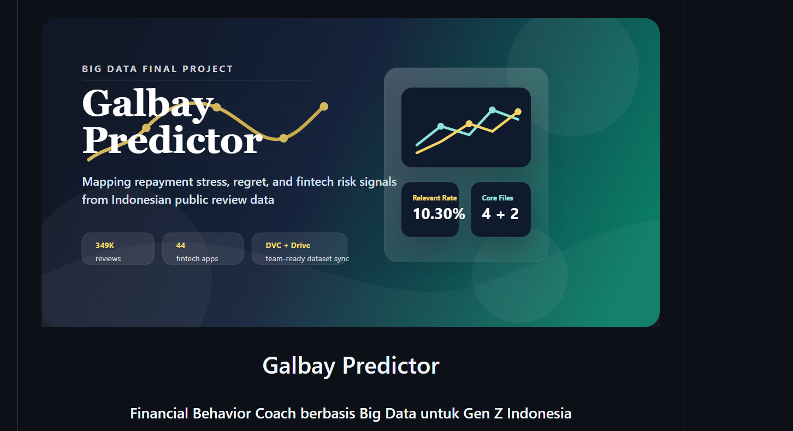

<div align="center">



# Galbay Predictor

### Financial Behavior Coach berbasis Big Data untuk Gen Z Indonesia

Repositori ini berisi pipeline scraping 7 sumber data, paket dataset terkurasi, ringkasan visual, dan aplikasi web Flask interaktif untuk final project mata kuliah Analisis Keputusan Bisnis.

[](https://www.python.org/)
[](https://flask.palletsprojects.com/)
[](tests/)
[]()
[]()
[]()
[]()
[](data/DOWNLOAD.md)

</div>

## Ringkasan

**Galbay Predictor** adalah proyek analisis perilaku finansial Gen Z berbasis **602.675 data publik multi-source**. Backbone datanya tetap **599.000 review Google Play Store** dari 53 aplikasi fintech Indonesia, sedangkan OJK/media, forum, blog, YouTube, Threads, dan Google Trends dipakai sebagai **konteks pendukung**, bukan bobot yang setara.

Repositori ini disusun untuk dua kebutuhan:

- anggota tim yang perlu mengambil dataset besar dengan alur yang jelas;
- reviewer yang ingin cepat memahami apa yang benar-benar kuat dari proyek ini: data besar, insight perilaku, batas model, lalu demo tools turunannya.

## Cara Membaca Project Ini

- **Data-first**: nilai utama proyek ada pada pemetaan sinyal distress finansial dari dataset publik besar.
- **Play Store-dominant**: label “multi-source” benar, tetapi volumenya tetap sangat didominasi review aplikasi di Google Play Store.
- **Prototype-aware**: beberapa tool di web bersifat **rule-based decision support**, bukan model ML generatif penuh.
- **Demo-focused**: chatbot, Galbay Score, dan simulator DC diposisikan sebagai alat bantu orientasi untuk demo, bukan diagnosis finansial formal.

## Highlights

- **602.675 item** dari 7 sumber, dengan **599.000 review Google Play Store** sebagai sumber volume utama
- **58.120 review relevan** (9,7% dari total) yang mengandung sinyal galbay/distress
- **11 kategori distress** untuk membaca pola gagal bayar, tekanan DC, bunga/biaya, dan perilaku impulsif
- **Model Multinomial Naive Bayes** untuk klasifikasi sentimen/relevansi pada review terpilih
- **Dashboard insight** yang memisahkan data-driven insight, rule-based support, dan demo interaction
- **Tool inti**:
  - **Galbay Score** — pembacaan awal risiko berbasis pola perilaku yang ditemukan di data publik
  - **Debt Planner** — simulasi snowball vs avalanche untuk strategi bayar
  - **Hadapi Tekanan DC** — simulator respons penagihan bercabang multi-turn
- **Tool pendukung**:
  - **Pinjol Checker**
  - **Emergency Runway Calculator**
  - **30-Day Action Plan**
  - **Recovery Roadmap 30/60/90**
- **Chat assistant rule-based** dengan intent routing, fallback klarifikasi, dan navigasi ke tool yang relevan
- **Distribusi data** memakai **DVC + Google Drive** agar anggota tim bisa `dvc pull` setelah setup OAuth sekali

## 🆕 What's New (Round 8-13)

| Round | Highlight | Commits |
|---|---|---|
| **Round 8** | Multi-source 7 platform (599K Play + 3.6K pendukung) | 7 commits |
| **Round 8** | BMC v2.0 dengan 9 blok data-driven | 1 commit |
| **Round 9** | Galbay Score Quiz (public, 6 pertanyaan) | 1 commit |
| **Round 10** | Topnav reorder (Produk + Galbay Score) | 1 commit |
| **Round 10** | Chatbot markdown renderer (XSS-safe) | 1 commit |
| **Round 10** | Theme polish (microinteractions, scroll reveal) | 1 commit |
| **Round 10** | Data expansion (blogs 506 → 2.142) | 1 commit |
| **Round 10** | **3 NEW TOOLS**: DC Simulator + Runway + 30-Day Plan | 1 commit |
| **Round 11** | Privacy + Terms pages (UU PDP) | 1 commit |
| **Round 11** | Multi-source analysis dashboard (charts) | 1 commit |
| **Round 12** | Bug fixes (chart labels, footer links, spacing) | 1 commit |
| **Round 13** | **DC Simulator v2 (multi-turn, 3-5 exchanges)** | 1 commit |
| **Round 13** | **Chatbot FAQ 38 → 60+ intents** | 1 commit |
| **Round 13** | **Free/Premium rate limits** (10 chat/day, 1 DC/day) | 1 commit |
| **Round 13** | **Advanced modeling metrics** (per-category + learning curve) | 1 commit |
| **Round 13** | **SWOT analysis** di kesimpulan page | 1 commit |

## Demo

```powershell
# 1. Install
pip install -r requirements.txt

# 2. Set up environment
copy .env.example .env
# Fill in GDRIVE_CLIENT_ID + GDRIVE_CLIENT_SECRET

# 3. Pull dataset (~180MB)
python scripts/setup_dvc_gdrive.py
dvc pull

# 4. Run
python run.py
# → http://localhost:5000
```

**Live demo publik**:
- [Galbay Predictor on Hugging Face Spaces](https://adan11-galbay-predictor.hf.space)

**Demo login** (no setup needed):
- `demo@galbay.id` / `demo123` — Free tier (10 chat/day, 1 DC/day)
- `premium@galbay.id` / `demo123` — Premium tier (unlimited all features)

## Deploy Gratis ke Hugging Face Spaces

Repo ini sekarang sudah disiapkan untuk **Hugging Face Docker Space** dalam mode **public demo stateless**.

- Runtime deploy memakai `requirements-runtime.txt`, bukan dependency scraping penuh.
- Container dijalankan lewat `gunicorn` pada port `7860`.
- Dataset besar **tidak** ditarik via DVC saat runtime.
- Register, waitlist, Google OAuth, dan penyimpanan lokal dimatikan pada deploy gratis.

Langkah ringkas:

1. Buat Space baru dengan SDK **Docker**.
2. Copy isi [HF_SPACE_README.md](HF_SPACE_README.md) menjadi `README.md` di repo Space.
3. Tambahkan `SECRET_KEY` di **Settings > Variables and secrets**.
4. Push source ke repo Space.
5. Login memakai akun demo:
   - `demo@galbay.id` / `demo123`
   - `premium@galbay.id` / `demo123`

URL deploy aktif saat ini:
- [https://adan11-galbay-predictor.hf.space](https://adan11-galbay-predictor.hf.space)

Panduan lengkap ada di [DEPLOY_HF.md](DEPLOY_HF.md).

## Tech Stack

| Layer | Tools |
|---|---|
| **Backend** | Flask 3.0, Python 3.12, Blueprint multi-page |
| **Frontend** | Vanilla JS, Chart.js 4.4, custom percentLabel plugin, IntersectionObserver |
| **Auth** | Hybrid Google OAuth (authlib) + demo login + JSON storage + usage tracking |
| **Data** | Pandas, NumPy, scikit-learn, DVC + Google Drive |
| **Scraping** | BeautifulSoup, Playwright (Kaskus SPA), requests, yt-dlp (YouTube) |
| **NLP** | Rule-based assistant (intent routing, synonym, typo tolerance, clarification fallback, markdown render) |
| **Testing** | pytest, 342 tests passing |

## Gambaran Dataset

| Komponen | Nilai |
|---|---|
| **Total multi-source** | **602.675 item** dari 7 platform |
| **Sumber utama** | Google Play Store (599K review, backbone insight) |
| **Sumber sekunder** | OJK + media, Forum, Blog, YouTube, Threads, Google Trends |
| **Aplikasi fintech** | 53 app Indonesia (paylater, pinjol, e-wallet, bank digital, dll) |
| **Periode Play Store** | 2015-10-02 s/d 2026-06-23 |
| **Ulasan relevan galbay** | 58.120 (9,7% dari total) |
| **Sinyal distress** | 13.827 ulasan (23,8% dari relevan) |
| **Severity tinggi** | 865 ulasan (target intervensi utama) |
| **Distribusi** | DVC + Google Drive (~200MB) |

### Multi-Source Breakdown

Catatan penting: label *multi-source* dipakai karena memang ada 7 sumber, tetapi pembacaan utama project tetap harus dibaca sebagai **Play Store-dominant dataset with supporting context**.

| Source | Items | % | Icon |
|---|---|---|---|
| Google Play Store | 599.000 | 99,1% | 📱 |
| Blog Indonesia | 2.142 | 0,4% | 📝 |
| YouTube (yt-dlp) | 1.614 (283 vids + 1.331 komentar) | 0,3% | ▶️ |
| Google Trends | 786 | 0,1% | 📈 |
| Forum (Kaskus) | 244 | <0,1% | 💬 |
| Threads (Meta) | 231 | <0,1% | 🧵 |
| OJK + Media | 160 | <0,1% | 📰 |

## Rincian Sumber Data

### Sumber utama (Google Play Store)
Dataset utama berasal dari review Google Play Store untuk **53** aplikasi fintech Indonesia (10 kategori).

### Kategori aplikasi yang dicakup

| Kategori | Aplikasi |
|---|---|
| `paylater` | Kredivo, Indodana, Akulaku, Atome, Kredito, Shopee Paylater, Tokopedia Paylater |
| `ecommerce` | Shopee, Tokopedia, Lazada, Bukalapak, Tiket.com, Traveloka |
| `ewallet` | DANA, Flip, GoPay, Gojek, LinkAja, OVO, Sakuku, ShopeePay, Blu by BCA |
| `pinjol` | AdaKami, Adapundi, BantuSaku, Cairin, Easycash, Finmas, Home Credit, Indosaku, JULO, KTA Kilat, KrediOne, Kredit Pintar, Maupinjam, PinjamUang, Pinjam Yuk, RupiahCepat, Singa Fintech, Tunaiku, UATAS, DanaCepat |
| `bank_digital` | Bank Jago, SeaBank, blu by BCA Digital, Jenius, Allo Bank, LINE Bank |
| `mobile_banking` | BRImo, Livin' by Mandiri, BCA Mobile, BNI Mobile, CIMB Niaga, Danamon |
| `p2p_lending` | KoinWorks, Amartha, Investree, Modalku, TaniFund, Akseleran |
| `investasi` | Bibit, Ajaib, Stockbit, Pluang, Bareksa, IPOT |
| `aggregator` | Cermati, Lifepal, Roojai |
| `kartu_kredit` | Honest |
| `koperasi` | Artha Niaga |

### Sumber pendukung (Non-Play)
- **OJK + Media** — 160 artikel (siaran pers, info terkini, liputan Kompas/Detik/CNBC)
- **Forum (Kaskus + Reddit)** — 244 threads diskusi utang, galbay, negosiasi
- **Blog Indonesia** — 2.142 posts (Medium, Hipwee, Kumparan, Brilio, CNBC, Kompas, Detik, dll)
- **YouTube (yt-dlp)** — 283 video + 1.331 komentar (review app, simulasi DC, recovery)
- **Threads (Meta)** — 231 posts Gen Z (FOMO, self reward, bahasa natural)
- **Google Trends** — 786 time-series 5 tahun (20 keyword grup)

## Lokasi dan File Data

| Lokasi | Isi |
|---|---|
| `data/raw/` | data mentah hasil scraping (60+ file JSON, multi-source) |
| `data/processed/` | data olahan utama (9 CSV: per-source + multi_source_combined) |
| `data/sample/` | sample kecil yang ikut tersimpan di repo |
| `data/site/` | output dashboard (data.js + PNG charts) |
| `data/pinjol_database.json` | database 50+ app pinjol legal + ilegal |

### File utama untuk analisis

| File | Fungsi |
|---|---|
| `data/processed/play_reviews_clean.csv` | ulasan Google Play (599K baris, kolom: query, app_name, category, score, content, date, is_relevant) |
| `data/processed/ojk_media_articles.csv` | OJK + media (160 artikel) |
| `data/processed/forum_threads.csv` | Kaskus + Reddit (244 threads) |
| `data/processed/blogs_id_posts.csv` | Blog Indonesia (2.142 posts) |
| `data/processed/youtube_videos.csv` | YouTube videos (283) |
| `data/processed/youtube_comments.csv` | YouTube comments (1.331) |
| `data/processed/threads_posts.csv` | Threads (231) |
| `data/processed/google_trends.csv` | Google Trends (786 time-series) |
| `data/processed/multi_source_combined.csv` | Combined (104K sampled dari 7 sources) |
| `data/site/data.js` | semua stats untuk dashboard (window.GALBAY_DATA) |
| `data/site/assets/*.png` | 5 chart PNG (confusion_matrix, distress_trend, top_neg_words, multi_source_breakdown, severity_distribution) |

## Arsitektur Aplikasi Web

```
app/
├── __init__.py        # Flask app factory
├── main.py            # 5 dashboard routes + 9 API endpoints + 3 tool endpoints
├── api.py             # Skor Risiko, Simulasi, Pinjol Checker, Debt Planner,
│                      # Recovery Roadmap, Chatbot v3 (60+ intents),
│                      # DC Simulator (multi-turn), Emergency Runway, 30-Day Plan,
│                      # Rate limits, 8 module FAQ
├── auth.py            # User model + Google OAuth + demo login + decorators + usage tracking
├── templates/
│   ├── index.html              # Landing page (vibrant redesign + featured tools)
│   ├── login.html              # 2-column login (Masuk/Daftar tabs)
│   ├── privacy.html            # UU PDP compliant Privacy
│   ├── terms.html              # Syarat & Ketentuan
│   ├── dashboard/
│   │   ├── base.html           # Topbar + chatbot widget + privacy/terms footer
│   │   ├── ringkasan.html      # Executive summary + KPI + multi-source stats
│   │   ├── analisis.html       # Per-category + multi-source + learning curve + CV folds
│   │   ├── solusi.html         # Inovasi + BMC 9 blok + Risk mitigation
│   │   ├── kesimpulan.html     # Key findings + SWOT Analysis
│   │   ├── produk.html         # 6 game-changer tools + pricing + premium
│   │   ├── dc_simulator.html   # Multi-turn DC Chat Simulator
│   │   ├── galbay_score.html   # Galbay Score Quiz
│   │   └── galbay_score_result.html  # Score result with recommendations
└── static/
    ├── css/style.css           # Dual theme (purple dark/light) + DC simulator + quiz + tools
    ├── js/
    │   ├── main.js             # Chart init + 20+ chart functions + scroll-reveal integration
    │   ├── produk.js           # Skor Risiko + Pinjol + Planner + Roadmap + Runway + 30-Day
    │   ├── chatbot.js          # AI Coach widget v3 (60+ intents, markdown, 429 handling)
    │   ├── data.js             # 602K multi-source data + per-category + learning curve
    │   ├── scroll-reveal.js    # IntersectionObserver + chart re-init on visible
    │   ├── theme.js            # Dark/light toggle
    │   └── quiz.js             # Galbay Score Quiz logic
    └── img/                    # Logo + favicon
```

## API Endpoints

| Endpoint | Method | Fungsi | Auth |
|---|---|---|---|
| `/api/health` | GET | health check | No |
| `/api/score` | POST | hitung Skor Risiko Galbay (rule-based) | No |
| `/api/simulate` | POST | simulasi cicilan dengan bunga flat | No |
| `/api/check-pinjol` | POST | cek status legal/ilegal pinjol | No |
| `/api/debt-planner` | POST | snowball vs avalanche + timeline | No |
| `/api/recovery-roadmap` | POST | generate 30/60/90 hari plan | No |
| `/api/chat` | POST | Assistant rule-based untuk FAQ + navigasi tool | Rate-limit 10/day free |
| `/api/waitlist` | POST | daftar waitlist premium | No |
| `/api/usage` | GET | current usage (rate limit tracking) | Auto |
| `/galbay-score` | GET/POST | Galbay Score Quiz (6 pertanyaan) | No |
| `/tools/dc-simulator` | GET/POST | DC Chat Simulator (multi-turn) | Rate-limit 1/day free |
| `/tools/emergency-runway` | POST | hitung emergency runway | No |
| `/tools/30-day-plan` | POST | generate 30-Day Action Plan | No |

## Galbay AI Coach v3 (Chatbot)

**Phase 3 NLP-like** dengan **60+ intents** across **8 modul**:

| Module | Topik | Intents |
|---|---|---|
| M1 Galbay Basics | Pengertian galbay, skor, simulasi, financial coach | 6 |
| M2 Pinjol | Legal/ilegal, OJK, bunga wajar, registered check | 8 |
| M3 Debt Strategy | Snowball, Avalanche, negosiasi, konsolidasi | 7 |
| M4 DC Negotiation | DC agresif, telpon malam, datang ke rumah, palsu | 8 |
| M5 Recovery | 30/60/90 hari, telat 7/30, tanpa kerja, nabung | 7 |
| M6 Legal Rights | UU PDP, ITE, OJK, SLIK, pembelaan pengadilan | 7 |
| M7 App Recommendation | blu/jago/seabank, kartu kredit vs paylater, dll | 9 |
| M8 Mental Health | Stress, krisis, konseling, dukungan keluarga | 9 |
| + default | smart fallback dengan top-3 closest | 1 |

**Smart features**:
- 🔤 **Synonym resolution** — "pinjol" matches "pinjaman online", "online", "p2p"
- 🔍 **Typo tolerance** — "snowbol" → snowball via difflib (>= 0.8 ratio)
- 🎯 **Multi-intent** — returns top 3 secondary intents for follow-up
- 💚 **Sentiment detection** — curious/stressed/crisis/grateful/positive
- ⏰ **Time-based greeting** — pagi/siang/sore/malam
- 📍 **Context-aware** — page-specific tips (ringkasan/produk/solusi)
- 🆘 **Crisis helpline** — auto-suggest Sejiwa 119 ext 8 untuk self-harm
- 🧠 **Markdown rendering** — full support untuk **bold**, *italic*, list, links
- 🎨 **Contextual Quick Replies** — 8 default + 9 category chips
- 🚨 **Smart fallback** — when conf < 0.1, suggest top 3 closest intent

## Modeling & Analysis

### Model Performance

| Metric | Score |
|---|---|
| Algorithm | Multinomial Naive Bayes (from scratch) |
| Accuracy | 0.858 |
| Precision | 0.903 |
| Recall | 0.815 |
| F1-Score | 0.857 |
| Macro F1 | 0.858 |
| 5-Fold CV Accuracy | 0.860 ± 0.003 |
| 5-Fold CV Macro F1 | 0.860 ± 0.003 |
| Vocab | 4.446 kata |

### Per-Category Performance (Top 8)

| Category | N Test | F1 Negatif | Predicted POS | Actual POS |
|---|---|---|---|---|
| kartu_kredit | 542 | 0.86 | 75.7% | 78.9% |
| pinjol | 4421 | 0.85 | 49.2% | 53.6% |
| paylater | 689 | 0.82 | 49.2% | 53.8% |
| bank_digital | 712 | 0.81 | 60.9% | 65.7% |
| p2p_lending | 487 | 0.80 | 58.1% | 61.7% |
| ewallet | 823 | 0.79 | 38.2% | 44.8% |
| ecommerce | 298 | 0.75 | 26.4% | 32.9% |
| mobile_banking | 312 | 0.74 | 23.0% | 31.4% |

## Premium Tier + Rate Limits

| Fitur | Free | Premium |
|---|---|---|
| Skor Risiko, Simulasi, Pinjol Checker | ✅ | ✅ + alerts |
| Recovery Roadmap | Preview | Full + save |
| Debt Planner | 1x/hari | ✅ unlimited |
| **Galbay AI Coach** | **10 pesan/hari** | **✅ unlimited** |
| **DC Chat Simulator** | **1 attempt/hari** | **✅ unlimited** |
| Save history | 3 | ✅ unlimited |
| Export PDF | ❌ | ✅ |
| Laporan Bulanan | ❌ | ✅ |

**Pricing**: Rp 49rb/bln atau Rp 399rb/tahun (diskon 50% tahun pertama).

## Tools & Pages

| Page | URL | Description |
|---|---|---|
| Landing | `/` | Hero + Featured Tools + Why Us + 7 source cards |
| Login | `/login` | Google OAuth + demo login |
| **Galbay Score Quiz** | `/galbay-score` | Public, 6 pertanyaan, scoring 0-100 |
| Dashboard Ringkasan | `/dashboard/ringkasan` | Executive summary + 4 KPI + charts |
| Dashboard Analisis | `/dashboard/analisis` | Multi-source + per-category + learning curve + CV folds |
| Dashboard Solusi | `/dashboard/solusi` | Inovasi + BMC 9 blok + Risk mitigation |
| Dashboard Kesimpulan | `/dashboard/kesimpulan` | Key findings + **SWOT Analysis** |
| Dashboard Produk | `/dashboard/produk` | 6 tools + pricing + premium |
| **DC Chat Simulator** | `/tools/dc-simulator` | Multi-turn conversation (3-5 exchanges) |
| Privacy | `/privacy` | UU PDP compliant |
| Terms | `/terms` | Syarat & ketentuan |

## Cara Mengambil Project dan Dataset

### 1. Clone repository
```powershell
git clone https://github.com/addaan1/Final-Project-AKB.git
cd Final-Project-AKB
```

### 2. Buat dan aktifkan virtual environment
```powershell
python -m venv .venv
.\.venv\Scripts\Activate.ps1
```

### 3. Install dependency
```powershell
pip install -r requirements.txt
```

### 4. Siapkan konfigurasi DVC Google Drive
```powershell
copy .env.example .env
```

Isi minimal field berikut di `.env`:
```env
GDRIVE_CLIENT_ID=your-client-id.apps.googleusercontent.com
GDRIVE_CLIENT_SECRET=your-client-secret
```

Lalu jalankan:
```powershell
python scripts/setup_dvc_gdrive.py
```

### 5. Ambil dataset besar dengan DVC
```powershell
dvc pull
```

Yang akan dipulihkan otomatis: `data/raw/`, `data/processed/`, `data/site/`.

### 6. Jalankan aplikasi
```powershell
python run.py
```

Buka `http://localhost:5000`.

## Testing

```powershell
# Run all tests
pytest tests/

# Run specific file
pytest tests/test_chatbot.py -v
```

**342 tests** passing:
- `test_api.py` — API logic (scoring, simulasi, pinjol, debt planner, recovery, chatbot, DC, runway)
- `test_auth.py` — User model, OAuth, login, upgrade
- `test_chatbot.py` — FAQ NLP v3 (60+ intents, synonyms, typos, multi-intent, sentiment, crisis)
- `test_game_changers.py` — Pinjol Checker, Debt Planner, Recovery Roadmap
- `test_routes.py` — Dashboard routes + auth integration
- `test_produk.py`, `test_simulasi.py`, `test_smoke.py` — integration tests
- `test_sentiment.py`, `test_sentiment_model.py`, `test_behavior_analysis.py` — modeling

## Struktur Project

```text
app/             aplikasi Flask (main.py, api.py, auth.py)
scraper/         pipeline pengumpulan data (10+ scrapers)
processing/      pembentukan CSV, sentiment, chart, dan SQLite
data/raw/        data mentah (60+ file JSON, multi-source)
data/processed/  output analisis terkurasi (9 CSV multi-source)
data/site/       output dashboard (data.js + PNG charts)
docs/            dokumen pendukung + API docs + business plan
tests/           342 unit & integration tests
assets/          chart PNGs untuk laporan
```

## Alur Kolaborasi

| Branch | Fungsi |
|---|---|
| `main` | branch utama yang stabil dan siap dipresentasikan |
| `scraping` | branch untuk pengolahan data, scraping, dan dataset |
| `fullstack` | branch untuk pengembangan aplikasi web + UI/UX (currently synced with main) |
| `feat/multi-source-700k` | branch eksperimen multi-source 600K+ (merged ke main via PR #9) |

Alur kerja yang disarankan:
1. kerjakan perubahan di branch yang sesuai;
2. sinkronkan branch dengan `main` sebelum lanjut kerja besar;
3. validasi hasil secara lokal (`pytest tests/`);
4. push branch ke GitHub;
5. buka pull request ke `main`;
6. merge setelah perubahan siap.

## Catatan tentang DVC

Konfigurasi DVC adalah jalur utama untuk mengambil dataset besar tim. Folder Google Drive tetap dipakai sebagai remote storage di belakang DVC, tetapi anggota tim seharusnya tidak perlu mengunduh dataset secara manual bila setup DVC sudah benar.

Pada alur ini:
- setiap anggota tim tetap harus punya akses ke folder Google Drive;
- `.dvc/config.local` bersifat lokal dan tidak boleh di-commit;
- `python scripts/setup_dvc_gdrive.py` akan menulis konfigurasi OAuth lokal untuk mesin masing-masing;
- `dvc pull` pertama biasanya akan membuka login atau consent Google di browser.

## Demo Login (Tanpa Setup)

Untuk coba aplikasi **tanpa setup DVC/OAuth**, pakai akun demo:
- `demo@galbay.id` / `demo123` — Free tier (10 chat/day, 1 DC/day)
- `premium@galbay.id` / `demo123` — Premium tier (semua fitur terbuka, unlimited)

## SWOT Analysis (Round 13)

### 💪 Strengths
- Data 602K dari 7 sumber (paling kaya di niche)
- Model Multinomial NB F1 0,857, CV stabil ±0,003
- 6 tools interaktif (DC Simulator, Runway, 30-Day Plan, dll)
- Privacy-first (no data keuangan pribadi dikumpulkan)

### ⚠️ Weaknesses
- Fitur masih rule-based, belum pakai LLM real-time
- Premium tier belum fully implemented (no payment gateway)
- 6 source non-Play masih tipis (Twitter/TikTok blocked)
- Onboarding mungkin terlalu panjang untuk Gen Z

### 🚀 Opportunities
- Pasar Gen Z Indonesia ~70 juta, 60% pengguna fintech
- OJK butuh tools edukasi (potential B2B partnership)
- Bisa ekspansi ke SEA (Filipina, Vietnam: similar pain)
- Premium tier Rp 49rb × 10K user = Rp 4,9M MRR potensial

### 🚧 Threats
- Pesaing: aplikasi budgeting besar (Money Lover, Finansialku)
- Bank digital sudah punya fitur serupa (Jenius, Jago)
- Regulasi OJK untuk financial advisor (mungkin butuh lisensi)
- Trust issue: scam di niche financial = sulit dapat user trust

## Tim

| Nama | NIM | Peran |
|---|---|---|
| Sahrul Adicandra Effendy | 164231013 | Big Data Engineer |
| Raihan Naufal Sauqi | 164231107 | Fullstack Engineer |
| Aflah Zein Japamel | 164231085 | Modeling Engineer |
| Muhammad Ilham Gustami | 164231089 | Fullstack Engineer |
| Mohammad Faizal Aprilianto | 164231095 | Big Data Engineer |

## Referensi Tambahan

- [data/README.md](data/README.md) — struktur dan isi paket data
- [data/DOWNLOAD.md](data/DOWNLOAD.md) — panduan mengambil dataset besar
- [docs/API.md](docs/API.md) — dokumentasi API endpoints
- [docs/business_plan.md](docs/business_plan.md) — konteks bisnis proyek
- [docs/bmc.md](docs/bmc.md) — Business Model Canvas 9 blok data-driven

## Lisensi

MIT License. Lihat [LICENSE](LICENSE).

---

<div align="center">

**Galbay Predictor** — *Membaca sinyal financial distress dari 602.675 item multi-source Indonesia.*

🟣 **Vibrant Purple Theme** · 🤖 **AI Coach v3 (60+ intents)** · 🎮 **6 Interaktif Tools** · 🔐 **Auth + Premium + Rate Limits**

</div>
