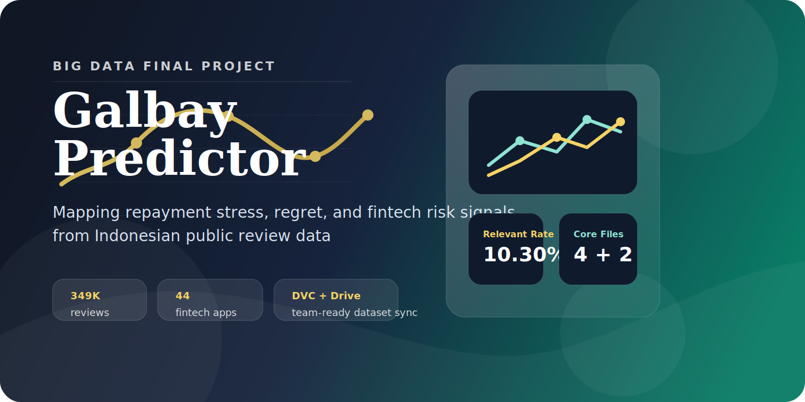

<div align="center">



# Galbay Predictor

### Membaca sinyal financial distress dari ulasan fintech Indonesia

Repositori ini berisi pipeline scraping, paket dataset terkurasi, ringkasan visual, dan aplikasi web ringan untuk final project mata kuliah Analisis Keputusan Bisnis.

[](https://www.python.org/)
[](https://flask.palletsprojects.com/)
[](data/DOWNLOAD.md)
[]()
[]()
[](LICENSE)

</div>

## Ringkasan

Galbay Predictor mempelajari bagaimana tanda-tanda gagal bayar, penyesalan finansial, impulsive spending, dan kecemasan penagihan muncul di ulasan publik aplikasi fintech. Sumber utama proyek ini adalah ulasan Google Play Store dalam skala besar, lalu diproses menjadi tabel analisis yang lebih rapi dan mudah dipakai tim.

Repository ini disusun untuk dua kebutuhan:

- anggota tim yang perlu mengambil dataset besar dengan alur yang jelas;
- reviewer yang ingin cepat memahami ruang lingkup, hasil data, dan nilai analisis proyek.

## Gambaran Dataset

| Komponen | Nilai |
|---|---|
| Sumber utama | Ulasan Google Play Store |
| Cakupan | 44 aplikasi fintech Indonesia |
| Total ulasan | 349.200 |
| Ulasan relevan galbay | 35.968 |
| Konteks pendukung | tabel validasi forum dan berita |
| Distribusi data | Google Drive + konfigurasi DVC |

## File Utama untuk Analisis

Folder `data/processed/` sengaja dirapikan agar anggota tim langsung tahu file mana yang paling penting.

### File inti

| File | Fungsi |
|---|---|
| `all_reviews.csv` | tabel utama semua ulasan |
| `relevant_only.csv` | subset ulasan yang terindikasi berkaitan dengan galbay |
| `per_app_summary.csv` | ringkasan per aplikasi untuk perbandingan |
| `timeline.csv` | tren ulasan per bulan |

### File pendukung

| File | Fungsi |
|---|---|
| `validated_forum.csv` | konteks diskusi forum yang sudah divalidasi |
| `validated_news.csv` | konteks berita dan regulator yang sudah divalidasi |
| `galbay.db` | paket SQLite untuk query atau dashboard |
| `charts/` | grafik siap pakai untuk laporan dan presentasi |

### File lanjutan

File turunan yang lebih berat tetap disimpan di `data/processed/advanced/` agar folder utama tidak membingungkan saat dipakai sehari-hari.

## Preview

| Tren Ulasan | Distribusi Kata Kunci |
|---|---|
|  |  |

## Cara Mengambil Project dan Dataset

### 1. Clone repository

```powershell
git clone https://github.com/addaan1/Final-Project-AKB.git
cd Final-Project-AKB
```

### 2. Siapkan environment

```powershell
python -m venv .venv
.\.venv\Scripts\Activate.ps1
pip install -r requirements.txt
```

### 3. Ambil dataset besar

Untuk kondisi proyek saat ini, jalur yang paling jelas dan aman untuk tim adalah:

1. clone repository GitHub;
2. buka folder Google Drive tim;
3. download isi dataset besar yang sudah disinkronkan pemilik repo;
4. letakkan hasilnya ke folder `data/raw/` dan `data/processed/`.

Panduan lengkapnya ada di [data/DOWNLOAD.md](data/DOWNLOAD.md).

### 4. Jalankan aplikasi

```powershell
python run.py
```

Lalu buka `http://localhost:5000`.

## Alur Dataset untuk Teman Satu Tim

Kalau temanmu ingin mulai dari nol sampai bisa ikut analisis, alurnya seperti ini:

1. clone repo dari GitHub;
2. install dependency dengan `pip install -r requirements.txt`;
3. buka folder Google Drive tim yang dibagikan;
4. download dataset besar terbaru;
5. taruh file hasil download ke `data/raw/` dan `data/processed/`;
6. cek file utama di `data/processed/` lalu mulai analisis.

File yang paling direkomendasikan untuk langsung dipakai:

- `data/processed/all_reviews.csv`
- `data/processed/relevant_only.csv`
- `data/processed/per_app_summary.csv`
- `data/processed/timeline.csv`
- `data/processed/validated_forum.csv`
- `data/processed/validated_news.csv`

## Catatan tentang DVC

Konfigurasi DVC tetap disimpan di repository karena struktur proyek memang dibangun dengan DVC. Namun untuk distribusi dataset terbaru saat ini, tim menggunakan sinkronisasi manual melalui Google Drive karena remote DVC belum stabil untuk proses push dari sesi kerja sekarang.

Kalau nanti remote DVC sudah aktif penuh lagi, alurnya bisa kembali menjadi:

```powershell
copy .env.example .env
python scripts/setup_dvc_gdrive.py
python -m dvc pull
```

## Struktur Project

```text
app/             aplikasi Flask
scraper/         pipeline pengumpulan data
processing/      pembentukan CSV, sentiment, chart, dan SQLite
data/raw/        data mentah
data/processed/  output analisis terkurasi
docs/            dokumen pendukung bisnis dan presentasi
tests/           smoke test dan unit test
```

## Alur Kolaborasi

| Branch | Fungsi |
|---|---|
| `main` | branch utama yang stabil dan siap dipresentasikan |
| `scraping` | branch untuk pengolahan data, scraping, dan dataset |
| `fullstack` | branch untuk pengembangan aplikasi web |

Alur kerja yang disarankan:

1. kerjakan perubahan di branch yang sesuai;
2. validasi hasil secara lokal;
3. push branch ke GitHub;
4. buka pull request ke `main`;
5. merge setelah perubahan siap.

## Tim

| Nama | NIM | Peran |
|---|---|---|
| Sahrul Adicandra Effendy | 164231013 | Big Data Engineer |
| Raihan Naufal Sauqi | 164231107 | Fullstack Engineer |
| Aflah Zein Japamel | 164231085 | Modeling Engineer |
| Muhammad Ilham Gustami | 164231089 | Fullstack Engineer |
| Mohammad Faizal Aprilianto | 164231095 | Big Data Engineer |

## Referensi Tambahan

- [data/README.md](data/README.md) untuk struktur dan isi paket data
- [data/DOWNLOAD.md](data/DOWNLOAD.md) untuk panduan mengambil dataset besar
- [docs/business_plan.md](docs/business_plan.md) untuk konteks bisnis proyek

## Lisensi

MIT License. Lihat [LICENSE](LICENSE).
